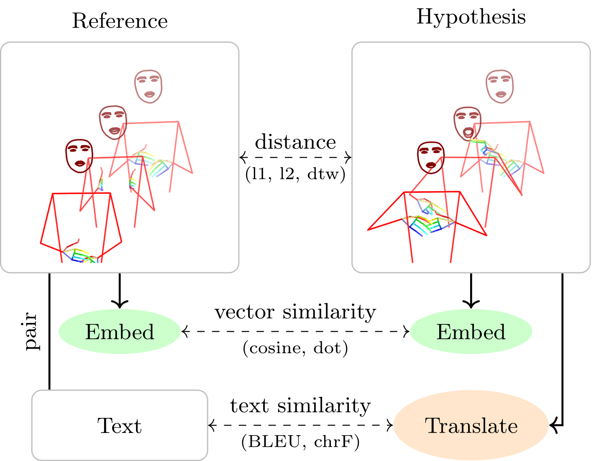

# Pose Evaluation

This repository provides tools and metrics for the automatic evaluation of pose sequences,
specifically designed for sign language applications.

This includes metrics proposed by Ham2Pose[^1] as well as custom-developed metrics unique to our approach.
We recognize the distinct challenges in evaluating single signs versus continuous signing,
and our methods reflect this differentiation.



## Usage

Install the package:

```shell
pip install git+https://github.com/sign-language-processing/pose-evaluation.git
```

Create a metric:

```python
from pose_evaluation.metrics.distance_metric import DistanceMetric
from pose_evaluation.metrics.dtw_metric import DTWDTAIImplementationDistanceMeasure
from pose_evaluation.metrics.pose_processors import *

DTWp = DistanceMetric(
    name="DTWp",
    # Select distance measure
    distance_measure=DTWDTAIImplementationDistanceMeasure(),
    # Provide pose processing pipeline
    pose_preprocessors=[
        TrimMeaninglessFramesPoseProcessor(),
        GetHandsOnlyHolisticPoseProcessor(), # select only the hands
        FillMaskedOrInvalidValuesPoseProcessor(masked_fill_value=10.0), # fill masked values with 10.0
        ReducePosesToCommonComponentsProcessor() # reduce pairs of poses to common components
    ],
)
```

Evaluate two pose sequences:

```python
from pose_format import Pose

with open("hypothesis.pose", "rb") as f:
    hypothesis = Pose.read(f)

with open("reference.pose", "rb") as f:
    reference = Pose.read(f)

DTWp.score(hypothesis, reference)
```

### Demo Notebook

For a demonstration of how to use the package, see the [demo notebook](datasets_to_dataframes_branch\examples\Pose_Evaluation_Example.ipynb)
<a target="_blank" href="https://colab.research.google.com/github/github.com/sign-language-processing/pose-evaluation/examples/Pose_Evaluation_Example.ipynb">

</a>

Demonstrates:

- How to reconstruct the metrics from our paper.
- How to use them to score poses, with signatures.
- How to score poses with different lengths, missing/undetected keypoints, or different keypoint formats.

### Contributing

Please make sure to run `make format` before submitting a pull request.

## Cite

If you use our toolkit in your research or projects, please consider citing the work.

```bib
@inproceedings{Jiang2025PoseEvaluation,
  title={Meaningful Pose-Based Sign Language Evaluation},
  author={Zifan Jiang, Colin Leong, Amit Moryossef, Oliver Cory, Maksym Ivashechkin, Neha Tarigopula, Biao Zhang, Anne Göhring, Annette Rios, Rico Sennrich, Sarah Ebling},
  booktitle={Conference on Machine Translation},
  year={2025},
  url={https://github.com/sign-language-processing/pose-evaluation}
}
```

### Contributions

- Zifan, Colin, and Amit developed the evaluation metrics and tools. Zifan did correlation and human evaluations, Colin did automated meta-eval, KNN, etc.
- Colin and Amit developed the library code.
- Zifan, Anne, and Lisa conducted the qualitative and quantitative evaluations.

## References

[^1]: Rotem Shalev-Arkushin, Amit Moryossef, and Ohad Fried. 2022. [Ham2Pose: Animating Sign Language Notation into Pose Sequences](https://arxiv.org/abs/2211.13613).
[^2]:
    Aashaka Desai, Lauren Berger, Fyodor O. Minakov, Vanessa Milan, Chinmay Singh, Kriston Pumphrey, Richard E. Ladner, Hal Daumé III, Alex X. Lu, Naomi K. Caselli, and Danielle Bragg.  
    2023. [ASL Citizen: A Community-Sourced Dataset for Advancing Isolated Sign Language Recognition](https://arxiv.org/abs/2304.05934).  
    _ArXiv_, abs/2304.05934.

[^3]:
    Lee Kezar, Elana Pontecorvo, Adele Daniels, Connor Baer, Ruth Ferster, Lauren Berger, Jesse Thomason, Zed Sevcikova Sehyr, and Naomi Caselli.  
    2023. [The Sem-Lex Benchmark: Modeling ASL Signs and Their Phonemes](https://api.semanticscholar.org/CorpusID:263334197).  
    _Proceedings of the 25th International ACM SIGACCESS Conference on Computers and Accessibility_.

[^4]:
    Thad Starner, Sean Forbes, Matthew So, David Martin, Rohit Sridhar, Gururaj Deshpande, Sam S. Sepah, Sahir Shahryar, Khushi Bhardwaj, Tyler Kwok, Daksh Sehgal, Saad Hassan, Bill Neubauer, Sofia Anandi Vempala, Alec Tan, Jocelyn Heath, Unnathi Kumar, Priyanka Mosur, Tavenner Hall, Rajandeep Singh, Christopher Cui, Glenn Cameron, Sohier Dane, and Garrett Tanzer.  
    2023. [PopSign ASL v1.0: An Isolated American Sign Language Dataset Collected via Smartphones](https://api.semanticscholar.org/CorpusID:268030720).  
    _Neural Information Processing Systems_.
